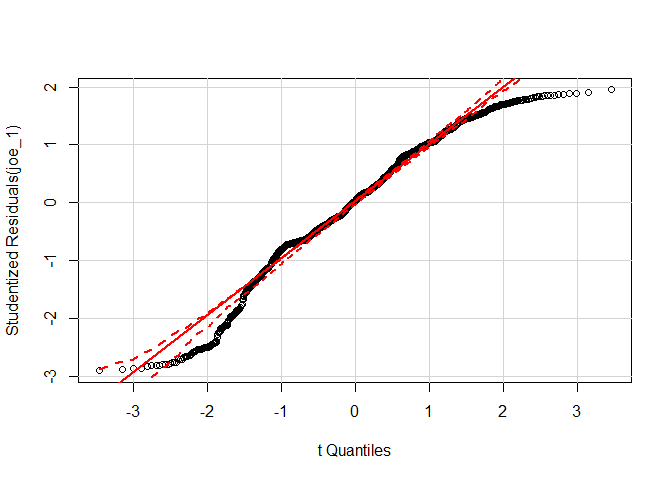
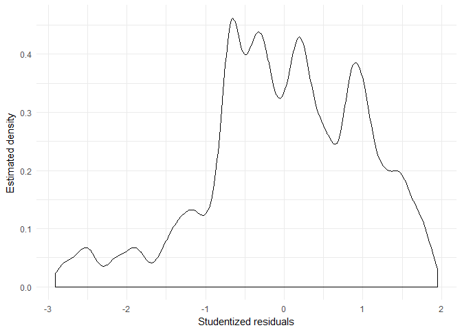
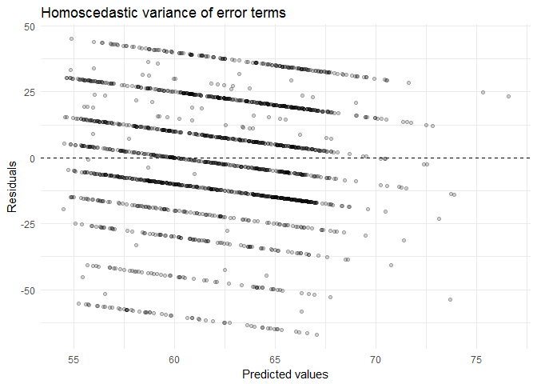
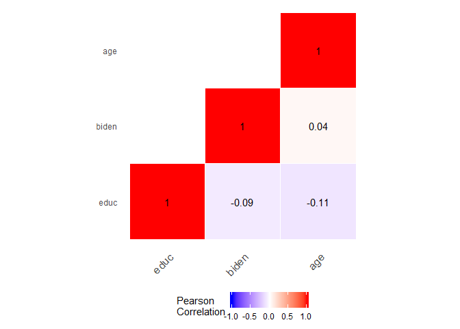
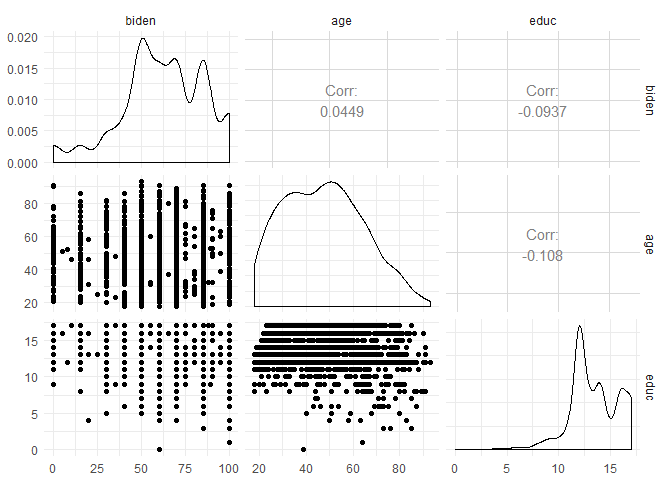
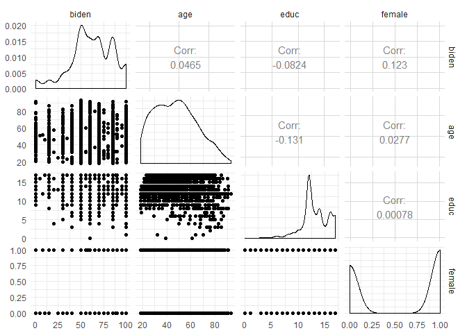
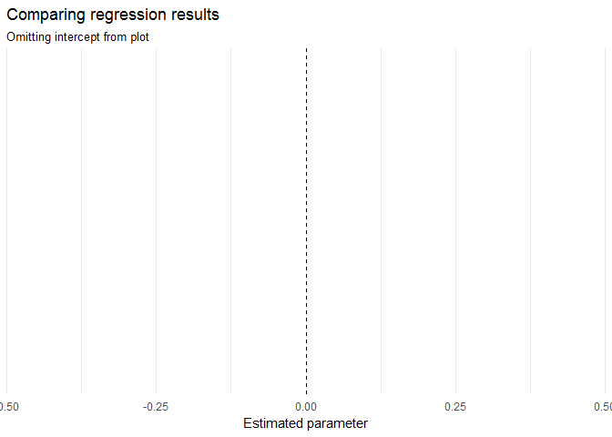

PS3
================
ChengYee Lim
05/14/2017

``` r
knitr::opts_chunk$set(message = FALSE,
                      warning = FALSE,
                      echo = FALSE)
```

Regression Diagnostics
======================

Non-normality of Errors
-----------------------

    ##           term estimate std.error statistic  p.value
    ## 1  (Intercept)  68.6210    3.5960     19.08 4.34e-74
    ## 2          age   0.0419    0.0325      1.29 1.98e-01
    ## 3 femaleFemale   6.1961    1.0967      5.65 1.86e-08
    ## 4         educ  -0.8887    0.2247     -3.96 7.94e-05



Heteroskedasticity
------------------



    ## 
    ##  studentized Breusch-Pagan test
    ## 
    ## data:  joe_1
    ## BP = 20, df = 3, p-value = 5e-05

The results of the Breusch-Pagan test shows that we reject the null hypothesis of homoskedastic standard errors at 1% significance level. We could attempt to correct for heteroscedasticity only in the standard error estimates with Huber-White standard errors. This produces the same estimated parameters, but adjusts the standard errors to account for the violation of the constant error variance assumption.

Multicollinearity
-----------------

 From the plots and heatmaps, we can see that multicollinearity is not an issue. The correlations between variables are very low.

Interactive Term
----------------

    ##          term estimate std.error statistic  p.value
    ## 1 (Intercept)   38.374    9.5636      4.01 6.25e-05
    ## 2         age    0.672    0.1705      3.94 8.43e-05
    ## 3        educ    1.657    0.7140      2.32 2.04e-02
    ## 4    age:educ   -0.048    0.0129     -3.72 2.03e-04

### Marginal Effect of Age on Joe Biden Thermometer Rating, Conditional on Education

We calculate the marginal effect of age on biden conditional on educ with:

$$\\frac{\\delta E(biden)}{\\delta age} = \\beta\_{1} + \\beta\_{3}educ$$
 Substituting the estimated coefficients from the model, we have the following equation to calculate the marginal effect of age:

$$\\frac{\\delta E(biden)}{\\delta age} = 0.672 + -0.048educ$$

Thus, the marginal effect of age on biden conditional on education has variable magnitude. For values of *e**d**u**c* &lt; 14 the effect on biden is positive, but for *e**d**u**c* ≥ 14 the effect is negative.

    ## Linear hypothesis test
    ## 
    ## Hypothesis:
    ## age  + age:educ = 0
    ## 
    ## Model 1: restricted model
    ## Model 2: biden ~ age * educ
    ## 
    ##   Res.Df    RSS Df Sum of Sq    F Pr(>F)    
    ## 1   1804 985149                             
    ## 2   1803 976688  1      8461 15.6  8e-05 ***
    ## ---
    ## Signif. codes:  0 '***' 0.001 '**' 0.01 '*' 0.05 '.' 0.1 ' ' 1

The hypothesis test also tells us that the marginal effect is highly significant.

### Marginal Effect of Education on Joe Biden thermometer rating, conditional on age

We calculate the marginal effect of education on biden conditional on age with:

$$\\frac{\\delta E(biden)}{\\delta educ} = \\beta\_{2} + \\beta\_{2}age$$
 Substituting the estimated coefficients from the model, we have the following equation to calculate the marginal effect of education:

$$\\frac{\\delta E(biden)}{\\delta educ} = 1.657  -0.0480educ$$

Thus, the marginal effect of education on biden conditional on age has variable magnitude. For values of *a**g**e* &lt; 35 the effect on biden is positive, but for *a**g**e* ≥ 35 the effect is negative.

    ## Linear hypothesis test
    ## 
    ## Hypothesis:
    ## educ  + age:educ = 0
    ## 
    ## Model 1: restricted model
    ## Model 2: biden ~ age * educ
    ## 
    ##   Res.Df    RSS Df Sum of Sq    F Pr(>F)  
    ## 1   1804 979537                           
    ## 2   1803 976688  1      2849 5.26  0.022 *
    ## ---
    ## Signif. codes:  0 '***' 0.001 '**' 0.01 '*' 0.05 '.' 0.1 ' ' 1

The hypothesis test shows that the marginal effect of education is highly significant.

Missing Data
------------

    ##   biden age educ female
    ## 1   460  46   11      0



    ## -- Imputation 1 --
    ## 
    ##   1  2  3  4  5  6
    ## 
    ## -- Imputation 2 --
    ## 
    ##   1  2  3  4  5  6
    ## 
    ## -- Imputation 3 --
    ## 
    ##   1  2  3  4  5  6
    ## 
    ## -- Imputation 4 --
    ## 
    ##   1  2  3  4  5
    ## 
    ## -- Imputation 5 --
    ## 
    ##   1  2  3  4

Several of these variables are clearly not normally distributed; transforming these variables will also help make the dataset more multivariate normal, so we can transform them before imputation.

    ##           term estimate std.error estimate.mi std.error.mi
    ## 1  (Intercept)  68.6210    3.5960     77.0239       10.088
    ## 2          age   0.0419    0.0325      0.0303        0.065
    ## 3 femaleFemale   6.1961    1.0967          NA           NA
    ## 4         educ  -0.8887    0.2247     -1.4026        0.609


